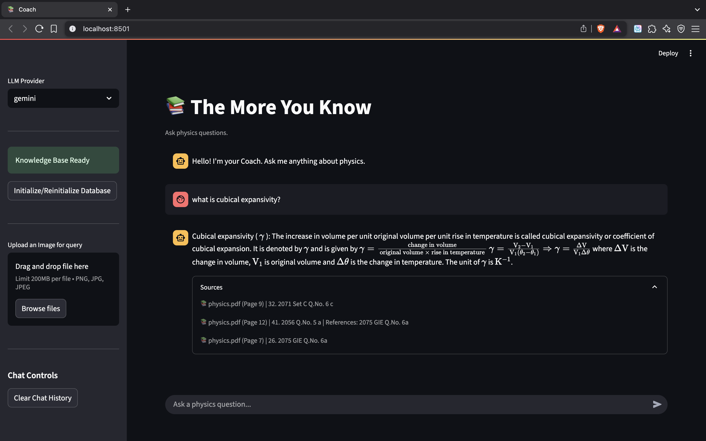
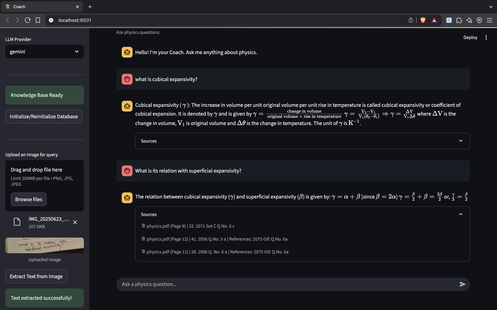

# 📚 Physics-RAG-Coach

A RAG Chatbot based on Class 11 Physics solution book built to ask physics questions.

## 🛠️ Requirements

- LangChain
- MistralAI
- Google Gemini
- Unstructured
- Chroma
- Streamlit

```bash
pip install -r requirements.txt
```

## 📷 Snapshots

|  | 
| :-------------------------------: |

|  |
| :-----------------------------------: |

## 👉 How to Use

To run the notebooks locally, follow these steps:

1. **Clone the repository**:

   ```bash
   git clone https://github.com/xaxm007/Physics-RAG-Coach.git
   cd Physics-RAG-Coach
   ```

2. **Create virtual environment**:

   ```bash
   python -m venv venv
   source venv/bin/activate
   ```

3. **Create a .env file to set up environment variables**:

    ```bash
    MISTRAL_API_KEY = "your_api_key"

    GOOGLE_API_KEY = "your_api_key"
    ```

4. **Run application**:

    ```bash
    streamlit run app.py
    ```

---